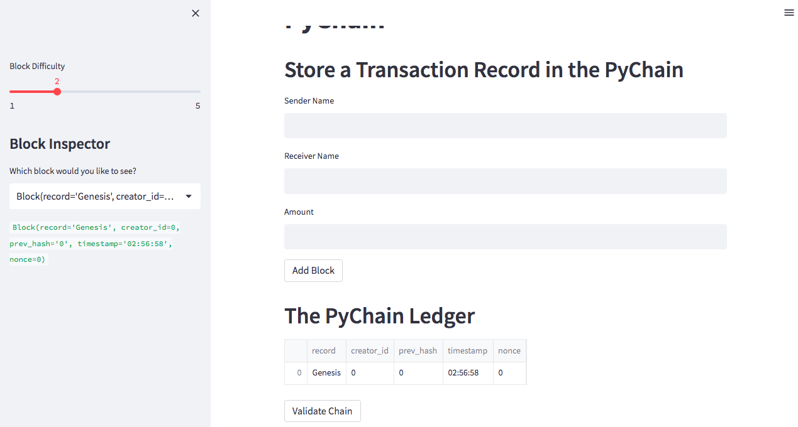
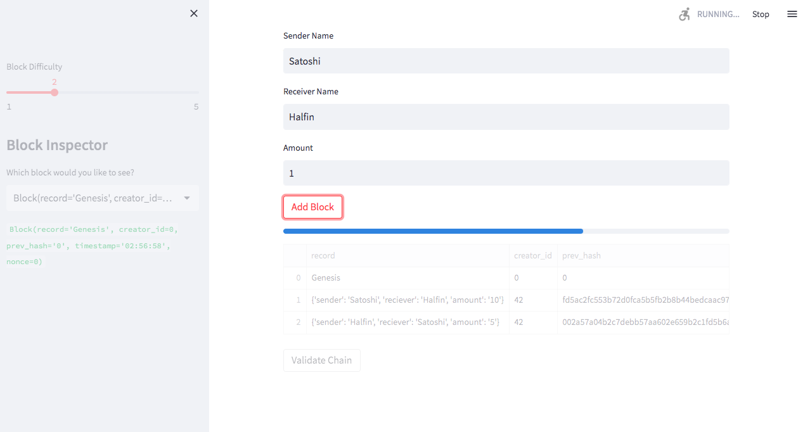
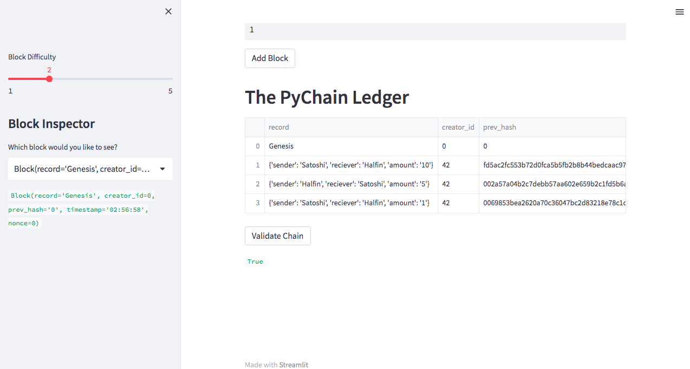
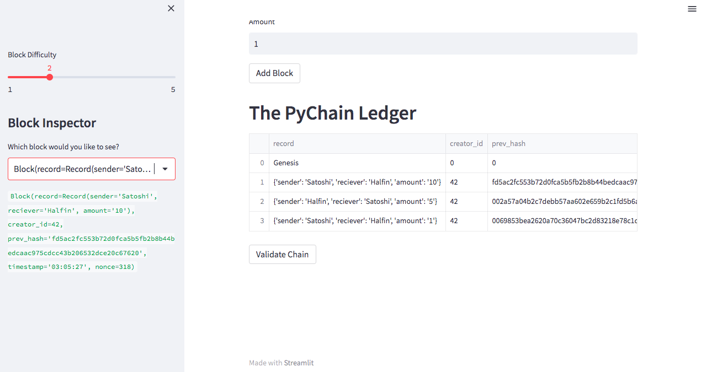
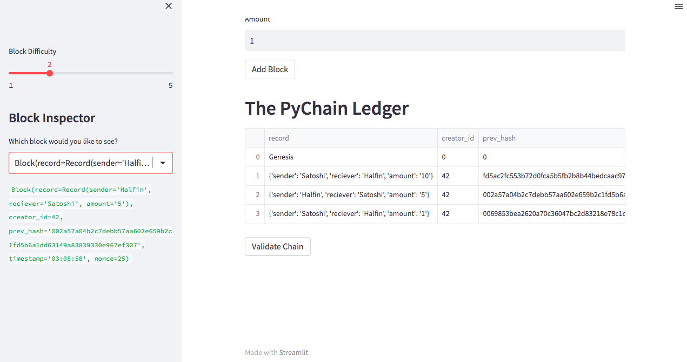
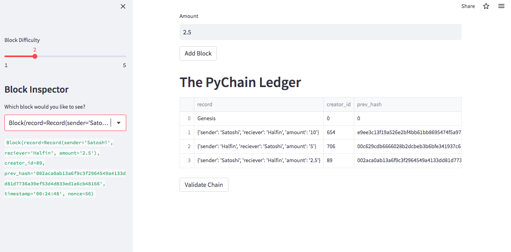

# $$PyChain-Ledger$$

In this repo I created a very simple blockchain [web application](https://olegreg762-pychain-ledger-pychain-7xvm6y.streamlit.app/), [pychain.py](/pychain.py).  This was done using the streamlit python library.  
Streamlit is a libray used to create web applications with the user only needing python. 
Using python and streamlit the simple blockchain application will allow you to create and store transaction data. 

## Genesis Block 

  
 
 ## This is an image of the application hashing for the next block 

  
 

 ## After hashing is complete and chain verified.

 
 

## Next three images will show how to look and each block using the sidebar drop down menu 

 

 

 