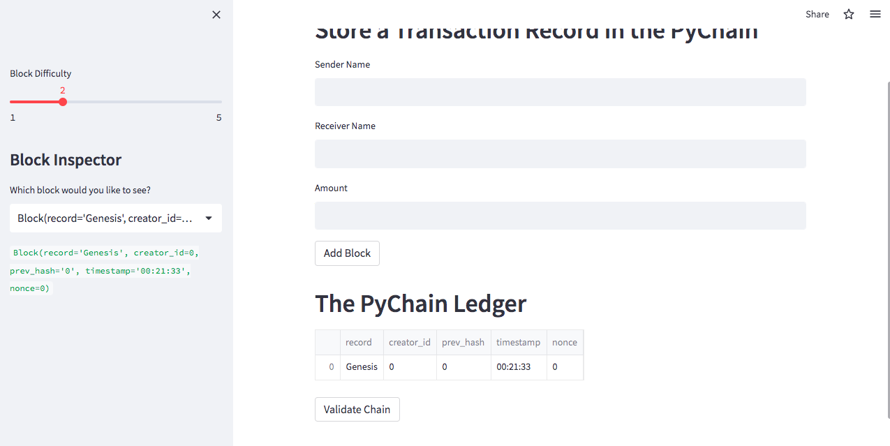
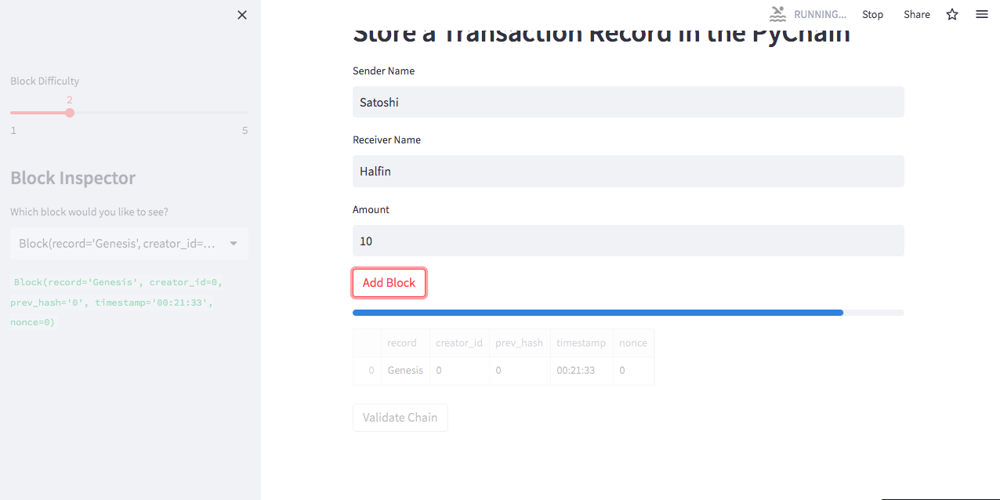
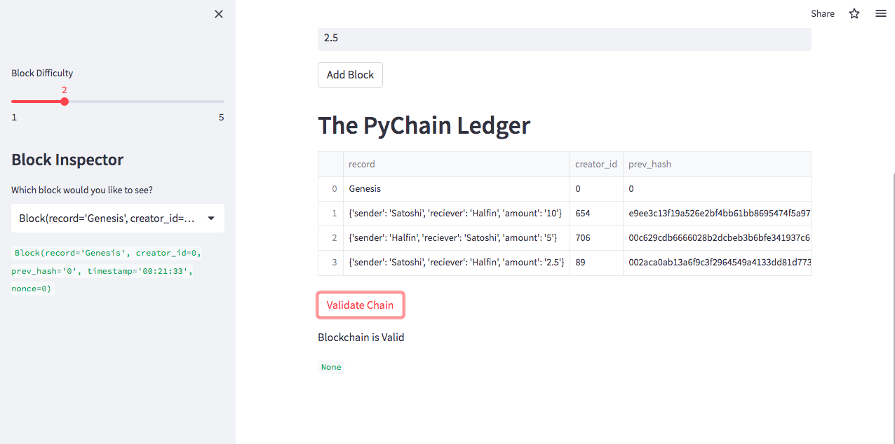
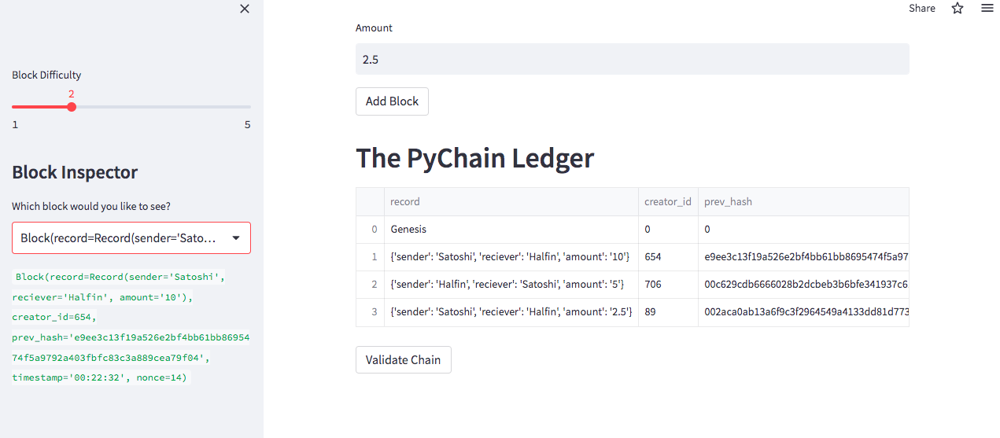
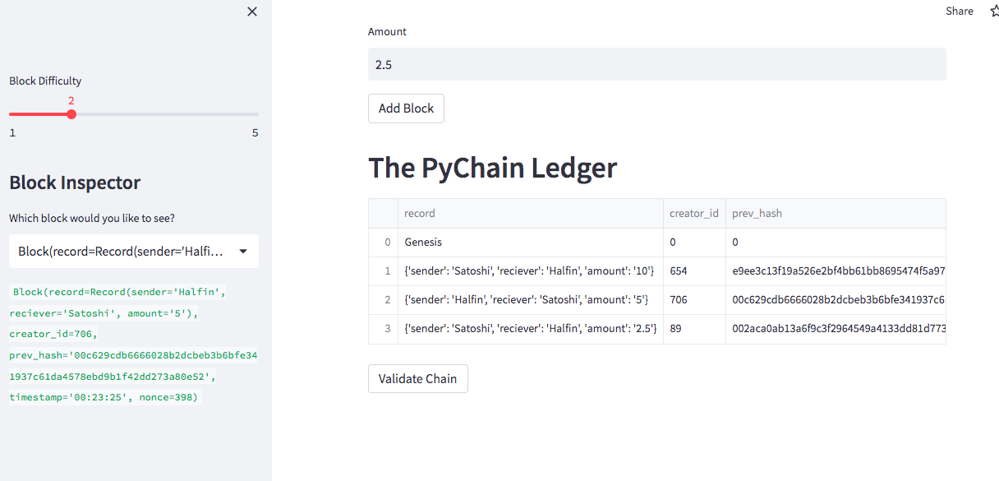

# $$PyChain-Ledger$$

In this repo I created a very simple blockchain web application [pychain.py](/pychain.py). This was done using the streamlit python library.  
Streamlit is a libray used to create web applications with the user only needing python. 
Using python and streamlit the simple blockchain application will allow you to create and store transaction data. 

The application can be run in 2 ways.
1. In terminal type `streamlit run paychain.py`
2. Use the hosted [web application](https://olegreg762-pychain-ledger-pychain-6sothb.streamlit.app/)

## Genesis Block 

  
 
 ## This is an image of the application hashing for the next block 

  
 

 ## After hashing is complete and chain verified.

 
 

## Next three images will show how to look and each block using the sidebar drop down menu 

 

 

 